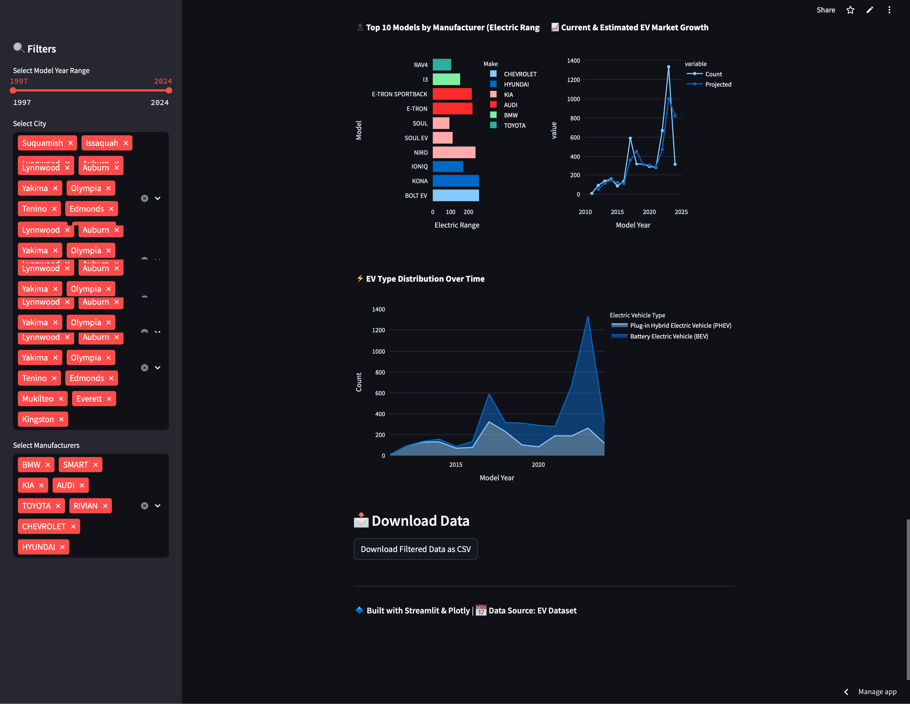

# 🚗 Electric Vehicle Market Dashboard

## 📊 Overview
This **EV Market Dashboard** is an interactive **data visualization tool** built with **Streamlit & Plotly**. It provides insights into **electric vehicle adoption**, **top manufacturers**, and **battery type distributions**.

## ✨ Features
✅ **EV Adoption Over the Years** 📈  
✅ **Top 10 Cities with Most EVs (by Country)** 🏙️  
✅ **EV Distribution by Battery Type** 🔋  
✅ **Top 10 EV Manufacturers** 🏆  
✅ **Forecasted EV Market Growth** 🔮  
✅ **Dynamic Filters (Year, Country, City, Manufacturer)**  

## 🚀 Live Demo
🔗 **[Try the Live Dashboard](https://ev-dashboard-5ak2glruigkcmsvby4prp7.streamlit.app/)**  

---
## 📷 Screenshots





## 🛠 Installation & Setup
To run this project **locally**, follow these steps:

### 🔹 **1. Clone the Repository**
```sh
git clone https://github.com/ShreedharBarot/EV-Dashboard.git
cd EV-Dashboard

